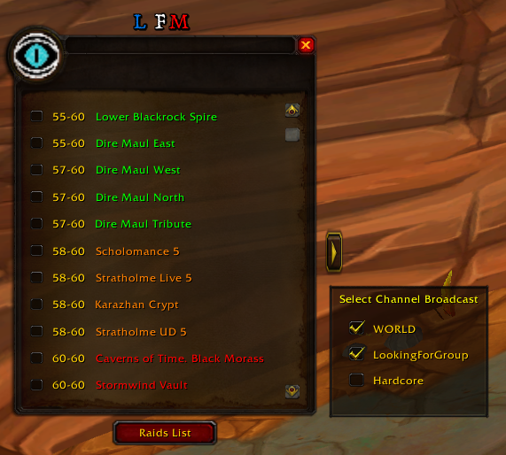
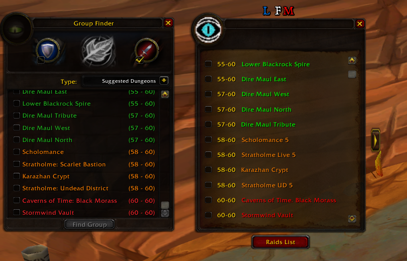
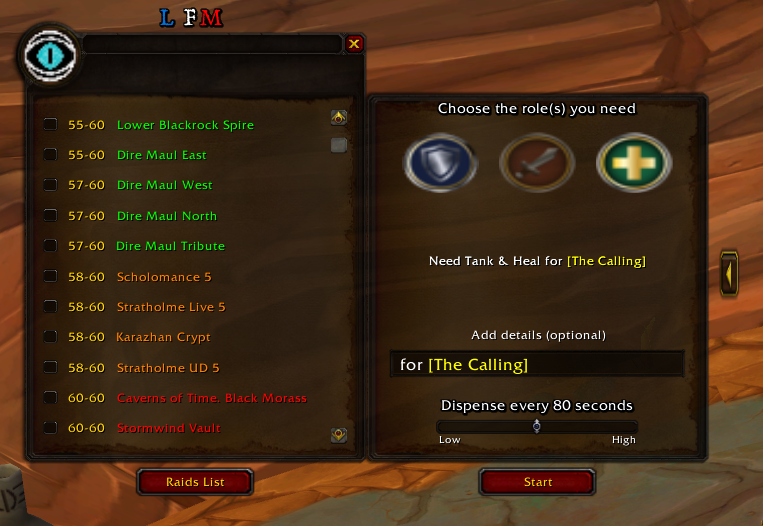
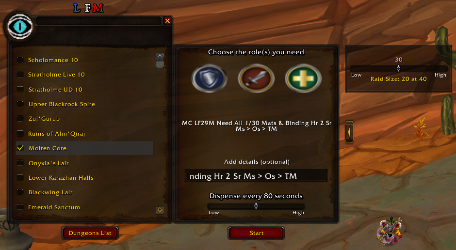

# autoLFM - README

https://github.com/FSuhas/AutoLFM

## Description

**autoLFM** est un addon pour **World of Warcraft 1.12** conçu pour automatiser le processus de recherche de groupe (LFM). Il permet aux joueurs de créer automatiquement un message de recherche de groupe, ce qui simplifie l'interaction avec le système de LFG (Looking for Group). Cet addon permet d'économiser du temps et en optimisant les chances de trouver rapidement un groupe pour des donjons ou d'autres activités multijoueurs.

## Image

## Fonctionnalités

- **Auto-message LFM** : Envoie automatiquement un message de recherche de groupe dans la fenêtre de discussion.
- **Compatibilité avec les donjons et les raids** : S'intègre directement aux mécanismes de recherche de groupe pour des donjons, raids ou autres activités de groupe.
- **Interface simple et légère** : Facilité d'utilisation sans ajout complexe à l'interface de jeu.

## Installation

1. Téléchargez le fichier de l'addon.
2. Décompressez le fichier téléchargé.
3. Déplacez le dossier `autoLFM` dans le répertoire `Interface/AddOns` de votre installation World of Warcraft 1.12.
4. Lancez World of Warcraft et connectez-vous à votre personnage.
5. Dans le menu de l'écran d'accueil, cliquez sur le bouton "AddOns" pour vérifier que **autoLFM** est activé.

## Slash Commandes

Les commandes Slash permettent d'interagir facilement avec l'addon via la fenêtre de discussion. Voici les principales commandes disponibles :

- `/lfm` : Ouvre la fenêtre de l'addon **AutoLFM**.
- `/lfm help` : Affiche la liste de toutes les commandes disponibles avec une brève description de chacune.
- `/lfm broadcast` : Ouvre la selection des channels.
- `/lfm minimap show` : Affiche le bouton de la mini-carte pour un accès rapide à l'addon.
- `/lfm minimap hide` : Masque le bouton de la mini-carte si vous ne souhaitez pas qu'il soit visible.
- `/lfm minimap reset` : Position du bouton de la minimap réinitialisée par défaut.

- **Message de recherche de groupe automatique** : Lorsque l'addon est activé, il envoie automatiquement un message dans le chat pour signaler que vous cherchez des joueurs pour rejoindre  votre groupe pour un donjon ou autre activité.

- **Personnalisation** : Vous pouvez ajuster le texte de votre message de recherche de groupe en ajoutant du texte via le menu de l'addon dans le jeu.

## Configuration

1. Ouvrez le menu des options de l'addon avec `/lfm`.
2. Vous pouvez personnaliser le message de recherche de groupe et définir des préférences spécifiques pour les types de groupes que vous souhaitez contruire.

## Dépannage

- **Le message LFM ne s'affiche pas** : Assurez-vous que l'addon est bien activé dans le menu AddOns avant de vous connecter.

## Aide et Support

Pour toute question, suggestion ou rapport de bug, vous pouvez nous contacter via les forums de WoW ou sur la page GitHub de l'addon.
